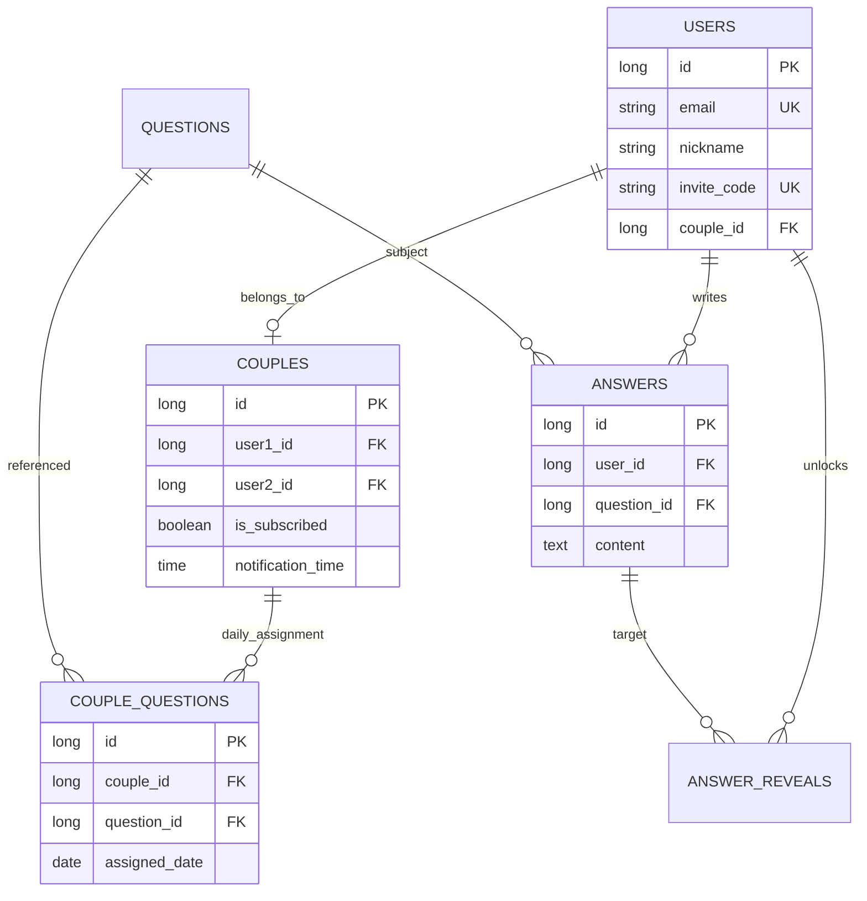

# 🔓 un:lock (언락) - 프라이빗 커플 대화 서비스

> **"답변을 완료해야만 열리는 상대방의 진심"**  
> un:lock은 커플들이 하루에 한 번 제공되는 질문에 답변하며 서로의 은밀한 취향과 깊은 가치관을 알아가는 **프라이빗 커플 상호작용 플랫폼**입니다. 단순히 기능을 구현하는 것을 넘어, **데이터의 무결성, 보안성, 그리고 분산 환경에서의 고가용성**을 목표로 설계되었습니다.

---

## 🏗 프로젝트 핵심 가치 & 도메인 전략

### 1. Reciprocity (상호 답변 기반의 공개 정책)
- **Problem**: 한쪽만 일방적으로 답변을 확인하고 대화가 단절되는 현상 방지.
- **Solution**: '상호 공개 원칙'을 코드 레벨에서 구현. 내가 답변을 등록해야만 파트너의 답변 영역이 활성화되며, 광고 시청 또는 구독 상태에 따라 최종 Unlock 되는 수익 모델 연동.

### 2. Intelligent Scheduling & Migration
- **Adaptive Questions**: 커플별 설정 시간에 맞춰 랜덤 질문 배정.
- **Zero-Stress Flow**: 답변을 미루더라도 질문이 쌓여 사용자에게 부담을 주지 않도록, 미완료 질문의 날짜를 오늘로 자동 갱신(Migration)하여 대화의 연속성 유지.

### 3. Privacy-First Architecture
- **Complete Destruction**: 커플 해제 또는 회원 탈퇴 시, 모든 대화 기록 및 열람 이력을 즉시 영구 파기(Hard Delete)하여 민감 정보를 철저히 보호.

---

## 🧠 Technical Challenges & Solutions (Hiring Highlights)

### 🛡 1. 분산 환경에서의 스케줄러 동기화 및 오차 보정
- **Challenge**: 다중 인스턴스(Multi-instance) 도커 환경에서 밀리초 단위의 시계 오차로 인해 질문 배정 로직이 중복 실행되거나 누락되는 현상 발생.
- **Solution**: 
    - **Redis Distributed Lock**: `SET NX` 기반의 분산 락을 도입하여 특정 분(`yyyyMMddHHmm`)에 대해 클러스터 내 단 하나의 작업만 실행되도록 보장.
    - **Clock Skew Handling**: `1초 Rounding` 보정 로직을 적용하여 0.001초 차이로 인한 시간 밀림 현상 근본적 해결.

### ⚡ 2. JPA N+1 문제 해결 및 조회 성능 98% 개선
- **Challenge**: 월별 아카이브 조회 시 질문 목록과 각 유저의 답변 여부를 각각 조회하여 쿼리 횟수가 `1 + 2N`으로 폭증(성능 병목).
- **Solution**: 
    - **Querydsl DTO Projections**: 조인 쿼리 한 번으로 질문 정보와 나/파트너의 답변 존재 여부(Boolean)를 즉시 가공하여 조회하도록 리팩토링.
    - **Result**: 한 달 조회 기준 쿼리 발생 횟수를 **61회에서 1회로 단축**, DB I/O 부하를 획기적으로 개선.

### 🔐 3. 보안 인증 체계 및 협업 효율화
- **Secure Auth**: `HttpOnly Cookie`와 `Refresh Token Rotation`을 적용하여 XSS 공격 방어 및 토큰 탈취 시나리오 대응.
- **Swagger Documentation**: 모든 API에 대해 명시적 응답 타입 매핑과 실전 예시 데이터(@Schema)를 제공하여 프론트엔드와의 계약(Contract)을 명확히 함.

---

## 🛠 Tech Stack (Confirmed Specs)
- **Framework**: `Spring Boot 3.3.4`, `Java 21`
- **ORM & Query**: `Spring Data JPA`, `Querydsl 5.0.0 (Jakarta)`
- **Database**: `PostgreSQL 16`, `Redis 7`
- **Security**: `Spring Security 6.x`, `JWT (jjwt 0.12.6)`, `BCrypt`, `OAuth2`
- **Infrastructure**: `Docker & Docker Compose`, `Nginx (Load Balancer)`, `M1 Pro (ARM64)` 최적화 빌드

---

## 🌐 Infrastructure Architecture
- **High Availability**: Nginx를 Entry Point로 배치, 운영 서버 3대 간의 **Round-robin 로드밸런싱** 및 **Fast Failover** 구현.
- **Isolated Environment**: 하나의 호스트 내에서 `.env.prod`와 `.env.dev` 설정을 분리하여 운영/개발 환경을 컨테이너 단위로 완벽 격리.

---

## 🗄 Database Schema (ERD)

