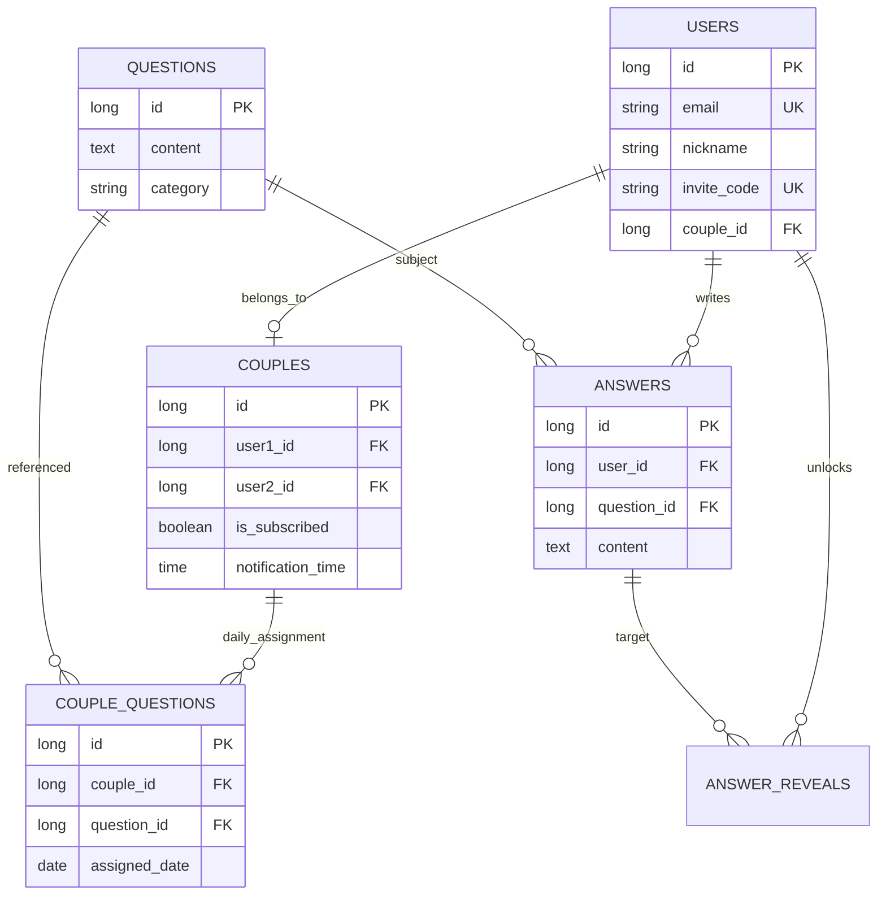

# 🔓 un:lock (언락) - 우리만의 은밀한 대화

> **"답변을 완료해야만 열리는 상대방의 진심"**  
> 커플들이 하루에 한 번 제공되는 맞춤형 질문에 답변하며, 서로의 깊은 취향과 가치관을 알아가는 프라이빗 커플 서비스입니다.

---

## 🚀 프로젝트 핵심 가치 (Core Features)

### 1. Reciprocity (상호성 기반의 소통)
- **Mutual Disclosure**: 내가 답변을 등록해야만 파트너의 답변 영역이 활성화됩니다.
- **Unlock Mechanism**: 광고 시청이나 구독을 통해 잠겨있는 파트너의 답변을 해제하는 수익 모델이 연동되어 있습니다.

### 2. Intelligent Scheduling (스마트한 질문 배정)
- **Custom Notification**: 커플마다 원하는 알림 시간을 설정하여 개인화된 경험을 제공합니다.
- **Automatic Migration**: 미완료된 질문이 있을 경우, 새로운 질문을 배정하는 대신 기존 질문의 날짜를 오늘로 이동시켜 대화의 연속성을 보장합니다.

### 3. Privacy & Security (프라이버시 보호)
- **Immediate Data Destruction**: 커플 해제 또는 회원 탈퇴 시, 모든 답변과 열람 기록을 즉시 영구 파기(Hard Delete)하여 민감한 정보를 철저히 보호합니다.
- **Secure Authentication**: HttpOnly 쿠키와 Refresh Token Rotation을 통해 보안 수준을 극대화했습니다.

---

## 🏗 Key Technical Highlights

### 🛡 분산 환경에서의 스케줄러 정밀 제어
- **Redis Distributed Lock**: 도커 컨테이너 다중화 환경에서 스케줄러가 중복 실행되는 문제를 `SET NX` 방식의 분산 락으로 해결했습니다.
- **Clock Skew Handling**: 0.001초 단위의 시계 오차로 인한 시간 밀림 및 누락 현상을 **1초 보정(Rounding) 로직**을 도입하여 완벽히 극대화했습니다.

### ⚡ 효율적인 아카이브 시스템 (Frontend Friendly)
- **Summary API**: 캘린더 구성을 위해 특정 월의 답변 여부만 빠르게 반환하는 요약 API를 구축하여 프론트엔드 성능을 최적화했습니다.
- **Secure Detail View**: 아카이브 조회 시에도 서비스의 핵심 정책(상호 답변 완료 여부 등)을 동일하게 검증하여 데이터 보안을 유지합니다.

---

## 🛠 Tech Stack
- **Backend**: Java 21, Spring Boot 4.0.2 (Standard)
- **Database**: PostgreSQL (Persistence), Redis (Auth / Lock / Cache)
- **Security**: Spring Security, JWT, BCrypt, HttpOnly Cookie
- **Infrastructure**: Docker, Nginx (Load Balancer), Multi-Scale Environment

---

## 🌐 Infrastructure Architecture
- **Load Balancing**: Nginx를 Entry Point로 배치하여 운영 서버 3대 간의 부하 분산 및 Fast Failover를 구현했습니다.
- **Environment Isolation**: `.env.prod`와 `.env.dev` 설정을 분리하여 하나의 호스트에서 운영과 개발 환경을 독립적으로 관리합니다.

---

## 🗄 Database Schema (ERD)

### 주요 도메인 구조
- **Users & Couples**: 1:1 매칭 구조 및 유저별 고유 초대 코드 관리.
- **Questions**: 카테고리별 질문 풀(Pool) 관리.
- **CoupleQuestions**: 커플별 랜덤 질문 배정 기록 및 날짜 Migration 관리.
- **Answers & Reveals**: 답변 데이터 및 광고/구독 기반 열람 권한(Unlock) 기록.

---

## 🔑 주요 API 플로우
1. **커플 매칭**: 초대 코드 발송 -> Redis 기반 신청 대기 -> 상대방 수락 -> 연결 완료.
2. **질문 배정**: 스케줄러가 정해진 시간에 미완료 질문 체크 또는 새 질문 랜덤 추출.
3. **답변/열람**: 내 답변 작성 -> 광고 시청/구독 체크 -> 상대방 답변 Unlock.
4. **기록 확인**: 월별 아카이브 조회 -> 캘린더 점(Dot) 표시 -> 상세 내용 복기.
