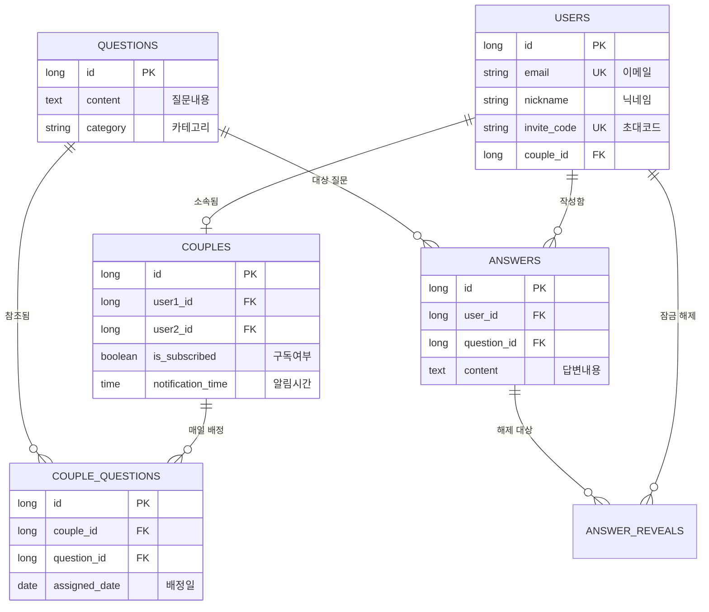

# 🔓 un:lock (언락) - 프라이빗 커플 대화 서비스

> **"두 사람 모두 답변을 완료해야 열리는 상대방의 진심"**  
> un:lock은 커플이 하루에 한 번 제공되는 질문에 답변하며, 서로의 깊은 취향과 가치관을 알아가는 **프라이빗 소통 플랫폼**입니다. 기능 구현을 넘어 **데이터 무결성, 보안성, 분산 환경의 가용성**을 고려하여 견고한 시스템을 구축하는 데 집중했습니다.

---

## 🏗 프로젝트 핵심 가치 및 도메인 로직

### 1. 답변 상호 작용 정책 (상호성 원칙)
- **문제 인식**: 한쪽만 일방적으로 답변을 확인하고 대화가 단절되는 것을 방지하고자 했습니다.
- **해결 방안**: '내가 먼저 답변을 등록해야만' 파트너의 답변 영역이 활성화되는 로직을 구현했습니다. 광고 시청이나 구독 상태에 따라 답변을 잠금 해제(Unlock)하는 수익 모델을 연동했습니다.

### 2. 스마트 질문 배정 및 관리
- **유동적인 질문 배정**: 커플마다 설정한 알림 시간에 맞춰 랜덤 질문이 배정됩니다.
- **이사(Migration) 로직**: 답변을 미루더라도 질문이 쌓여 사용자에게 부담을 주지 않도록, 미완료된 질문의 날짜를 자동으로 오늘로 옮겨주어 대화의 연속성을 보장합니다.

### 3. 프라이버시 보호 시스템
- **즉시 파기 정책**: 커플 해제나 회원 탈퇴 시, 모든 대화 기록과 열람 이력을 단순히 숨기는 것이 아니라 DB에서 즉시 영구 삭제(Hard Delete)하여 민감한 정보를 철저히 보호합니다.

---

## 🧠 주요 기술적 도전 및 해결 사례

### 🛡 1. 분산 환경에서의 스케줄러 중복 실행 방지
- **도전 과제**: 도커 컨테이너를 여러 대 띄운 환경에서 미세한 시계 오차로 인해 질문 배정 로직이 중복 실행되거나 시간이 밀리는 현상이 발생했습니다.
- **해결 방안**: 
    - **Redis 분산 락(Distributed Lock)**을 도입하여 특정 분(`yyyyMMddHHmm`)에 대해 전체 클러스터에서 딱 한 번만 작업이 실행되도록 보장했습니다.
    - **1초 보정(Rounding)** 로직을 추가하여 0.001초 차이로 작업이 누락되거나 분이 어긋나는 문제를 해결했습니다.

### ⚡ 2. JPA N+1 문제 해결을 통한 조회 성능 극대화
- **도전 과제**: 월별 기록 조회 시 질문 목록과 각 사용자의 답변 여부를 매번 따로 조회하면서 쿼리가 폭증(한 달 기준 약 60회 이상)하는 성능 병목이 확인되었습니다.
- **해결 방안**: 
    - **Querydsl DTO 직접 조회(Projections)**를 도입하여, 한 번의 Join 쿼리로 질문 정보와 답변 여부(Boolean)를 즉시 가공해서 가져오도록 리팩토링했습니다.
    - **결과**: 쿼리 발생 횟수를 **61회에서 1회로 단축**하여 데이터베이스 부하를 획기적으로 줄였습니다.

### 🔐 3. 보안 인증 체계 및 협업 효율화
- **보안 강화**: `HttpOnly 쿠키`와 `Refresh Token Rotation`을 적용해 XSS 공격을 방어하고, 토큰 탈취 위험을 최소화했습니다.
- **문서화**: 모든 API에 대해 명확한 응답 타입과 실제 서비스 데이터를 담은 예시(@Schema)를 Swagger에 제공하여 프론트엔드와 소통 비용을 낮췄습니다.

---

## 🛠 기술 스택 (Tech Stack)
- **언어 및 프레임워크**: `Java 21`, `Spring Boot 3.3.4`
- **데이터베이스**: `PostgreSQL 16`, `Redis 7` (인증/락/캐시)
- **ORM**: `Spring Data JPA`, `Querydsl 5.0.0 (Jakarta)`
- **인프라**: `Docker & Docker Compose`, `Nginx (로드밸런서)`, `M1 Pro (ARM64)` 빌드 최적화
- **보안**: `Spring Security`, `JWT (jjwt 0.12.6)`, `BCrypt`, `OAuth2`

---

## 🌐 인프라 구조 (Architecture)
- **로드밸런싱**: Nginx를 앞단에 두어 운영 서버 3대 간의 **Round-robin 부하 분산** 및 **Fast Failover**를 구현했습니다.
- **환경 격리**: 하나의 호스트 안에서 운영(Prod)과 개발(Dev) 설정을 분리하여 컨테이너 단위로 완벽하게 독립적인 환경을 구축했습니다.

---

## 🗄 데이터베이스 설계 (ERD)

