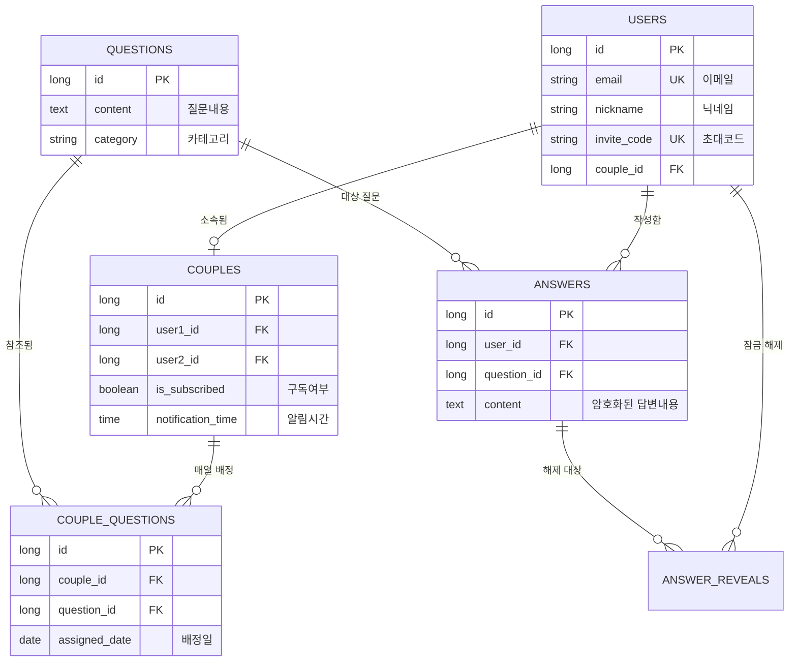

# 🔓 un:lock (언락) - 프라이빗 커플 대화 서비스

> **"두 사람 모두 답변을 완료해야 열리는 상대방의 진심"**  
> un:lock은 커플이 하루에 한 번 제공되는 질문에 답변하며, 서로의 깊은 취향과 가치관을 알아가는 **프라이빗 소통 플랫폼**입니다. 기능 구현을 넘어 **데이터 보안성, 개인정보 보호, 분산 환경의 안정성**을 최우선으로 설계되었습니다.

---

## 🏗 프로젝트 핵심 가치 및 도메인 로직

### 1. 답변 상호 작용 정책 (상호성 원칙)
- **문제 인식**: 한쪽만 일방적으로 답변을 확인하고 대화가 단절되는 것을 방지하고자 했습니다.
- **해결 방안**: '상호 공개 원칙'을 코드 레벨에서 구현. 내가 먼저 답변을 등록해야만 파트너의 답변 영역이 활성화되며, 광고 시청이나 구독 상태에 따라 최종 잠금이 해제되는 시스템을 구축했습니다.

### 2. 스마트 질문 관리 시스템
- **유동적인 질문 배정**: 커플마다 설정한 알림 시간에 맞춰 중복 없는 랜덤 질문이 배정됩니다.
- **질문 이월(Carry-over) 로직**: 답변을 미루더라도 질문이 날짜별로 쌓여 사용자에게 부담을 주지 않도록, 미완료된 질문의 날짜를 자동으로 오늘로 갱신하여 대화의 연속성을 보장합니다.

### 3. 프라이버시 보호 시스템
- **AES-256 데이터 암호화**: 사용자의 답변 내용을 DB에 그대로 저장하지 않고, 애플리케이션 레벨에서 **AES-256 양방향 암호화**를 적용하여 데이터 유출 시에도 원문을 철저히 보호합니다.
- **즉시 파기 정책**: 커플 해제나 회원 탈퇴 시, 모든 대화 기록과 암호화된 답변 데이터를 단순히 숨기는 것이 아니라 DB에서 즉시 영구 삭제(Hard Delete)하여 개인정보를 보호합니다.

---

## 🧠 주요 기술적 도전 및 해결 사례

### 🛡 1. 분산 환경에서의 스케줄러 무결성 보장
- **도전 과제**: 다중 컨테이너 환경에서 미세한 시계 오차로 인해 질문 배정 로직이 중복 실행되거나 시간 밀림 현상이 발생했습니다.
- **해결 방안**: 
    - **Redis 분산 락(Distributed Lock)**을 도입하여 특정 시간대에 전체 클러스터에서 딱 한 번만 작업이 실행되도록 보장했습니다.
    - **1초 보정(Rounding)** 로직을 추가하여 밀리초 단위의 오차로 인한 작업 누락 문제를 근본적으로 해결했습니다.

### ⚡ 2. JPA N+1 문제 해결 및 조회 성능 극대화
- **도전 과제**: 월별 기록 조회 시 질문 목록과 각 사용자의 답변 여부를 개별 조회하면서 발생하는 `1 + 2N` 쿼리 폭증 문제를 해결해야 했습니다.
- **해결 방안**: 
    - **Querydsl DTO 직접 조회(Projections)**를 통해 단 한 번의 Join 쿼리로 결과물을 가공하여 가져오도록 리팩토링했습니다.
    - **결과**: 쿼리 발생 횟수를 **61회에서 1회로 단축**하여 데이터베이스 부하를 획기적으로 줄였습니다.

### 🔐 3. 보안 인증 체계 고도화
- **보안 전략**: `HttpOnly 쿠키`와 `Refresh Token Rotation`을 적용해 XSS 공격을 차단하고 인증의 영속성과 보안성을 동시에 확보했습니다.
- **문서화**: 모든 API에 대해 명시적 응답 매핑과 실제 데이터를 반영한 Swagger 문서를 구축하여 협업 효율성을 높였습니다.

---

## 🛠 기술 스택 (Tech Stack)
- **Framework**: `Spring Boot 3.3.4`, `Java 21`
- **Database**: `PostgreSQL 16`, `Redis 7`
- **ORM & Query**: `Spring Data JPA`, `Querydsl 5.0.0`
- **Security**: `Spring Security 6.x`, `JWT (jjwt 0.12.6)`, `AES-256`
- **Infrastructure**: `Docker & Docker Compose`, `Nginx (Load Balancer)`

---

## 🗄 데이터베이스 설계 (ERD)

