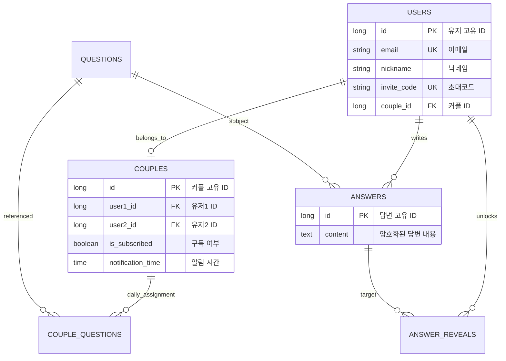

# 🔓 un:lock (언락) - 프라이빗 커플 상호작용 플랫폼 (Backend)

> **"두 사람 모두 답변을 완료해야 열리는 상대방의 진심"**  
> un:lock은 커플들이 매일 제공되는 질문에 답변하며 서로의 깊은 가치관을 알아가는 서비스입니다. 단순히 기능을 구현하는 것을 넘어, **실제 상용 서비스 수준의 성능 최적화, 보안 계층 구축, 그리고 인프라 자동화**를 목표로 설계되었습니다.

---

## 🏗️ 시스템 아키텍처 및 인프라 (DevOps)

### 1. 고가용성 인프라 구성 (Nginx & Docker)
- **로드밸런싱**: Nginx를 리버스 프록시 및 로드밸런서로 배치하여 다중 앱 인스턴스 환경을 구축했습니다.
- **환경 격리**: `ENV` 변수 기반의 환경 관리를 통해 운영(`prod`)과 개발(`dev`) 서버를 하나의 호스트 내에서 완벽하게 독립적으로 운영합니다.
- **헬스체크**: Docker의 `healthcheck` 기능을 통해 컨테이너 상태를 실시간 모니터링하며, 비정상 인스턴스로의 트래픽 유입을 차단합니다.

### 2. CI/CD 파이프라인 (GitHub Actions)
- GitHub Actions를 활용하여 **빌드-테스트-이미지 푸시-배포** 전 과정을 자동화했습니다.
- **무중단 배포**: 신규 이미지 배포 시 기존 인스턴스를 유지하며 순차적으로 교체하는 롤링 업데이트 방식을 적용하여 가용성을 보장합니다.

---

## 🧠 주요 기술적 해결 및 최적화 사례 (Troubleshooting)

### ⚡ 1. JPA N+1 문제 해결 및 쿼리 성능 극대화
- **문제**: 아카이브(캘린더) 조회 시 질문 목록과 각 사용자의 답변 여부를 개별적으로 조회하여 쿼리 발생 횟수가 폭증하는 병목 지점을 발견했습니다.
- **해결**: **Querydsl DTO Projections**를 도입, 단 한 번의 Join 쿼리로 필요한 데이터(질문 정보 + 나/파트너의 답변 존재 여부)를 가공하여 조회하도록 리팩토링했습니다.
- **결과**: 월별 조회 기준 **쿼리 발생 횟수를 61회에서 1회로 단축**하여 DB 부하를 획기적으로 개선했습니다.

### 🛡️ 2. 데이터 프라이버시 및 보안 계층 강화
- **내용 암호화**: 민감한 답변 내용을 보호하기 위해 JPA `AttributeConverter`를 활용한 **AES-256 애플리케이션 레벨 암호화**를 구현했습니다. DB 유출 시에도 원문 보호가 가능합니다.
- **인증 보안**: `HttpOnly Cookie`를 통한 Refresh Token 관리와 `CORS 명시적 제한`(운영 도메인 한정)을 통해 XSS 및 CSRF 공격에 대한 방어 체계를 구축했습니다.

### 🔔 3. 푸시 알림 시스템 고도화 (FCM)
- **대량 발송 최적화**: 구글의 최신 FCM Batch API인 **`sendEach()`**를 적용하여 다중 기기 발송 성능을 개선했습니다.
- **지능형 라우팅**: 알림의 `Data Payload`에 **`NotificationType`**(Enum)을 포함하여, 앱이 알림 수신 시 종류에 따라 적절한 화면으로 이동할 수 있도록 설계했습니다.
- **비동기 처리**: `@Async`를 활용하여 알림 발송이 메인 비즈니스 로직의 응답 속도에 영향을 주지 않도록 격리했습니다.

---

## 🛠️ 기술 스택 (Tech Stack)

- **Backend**: `Java 21`, `Spring Boot 3.3.4`, `Spring Security`, `Spring Data JPA`
- **Query**: `Querydsl 5.0.0 (Jakarta)`, `PostgreSQL 16`
- **Infra**: `Nginx`, `Docker & Docker Compose`, `GitHub Actions`, `Redis 7`
- **Auth**: `JWT (jjwt 0.12.6)`, `OAuth2 (Kakao)`, `BCrypt`
- **Docs**: `Swagger (OpenAPI 3.0)` - 명시적 응답 매핑 및 실전 예시 데이터(@Schema) 제공

---

## 🌐 서버 주소 및 API 문서
- **운영 환경(Production)**: [api.unlock-official.app](https://api.unlock-official.app)
- **개발 환경(Development)**: [dev-api.unlock-official.app](https://dev-api.unlock-official.app)
- **API Documentation**: [Swagger UI 바로가기 (dev)](https://dev-api.unlock-official.app/swagger-ui/index.html)
  - ⚠️ **보안 안내**: 모든 API 문서는 Spring Security(Basic Auth)로 보호되고 있습니다. 기술 검토를 위한 테스트 계정은 별도로 요청해 주시기 바랍니다.

---

## 🗄️ 데이터베이스 설계 (ERD)

```mermaid
erDiagram
    USERS ||--o| COUPLES : "belongs_to"
    COUPLES ||--o{ COUPLE_QUESTIONS : "daily_assignment"
    QUESTIONS ||--o{ COUPLE_QUESTIONS : "referenced"
    USERS ||--o{ ANSWERS : "writes"
    QUESTIONS ||--o{ ANSWERS : "subject"
    USERS ||--o{ ANSWER_REVEALS : "unlocks"
    ANSWERS ||--o{ ANSWER_REVEALS : "target"

    USERS {
        long id PK "유저 고유 ID"
        string email UK "이메일"
        string nickname "닉네임"
        string invite_code UK "초대코드"
        long couple_id FK "커플 ID"
    }
    COUPLES {
        long id PK "커플 고유 ID"
        long user1_id FK "유저1 ID"
        long user2_id FK "유저2 ID"
        boolean is_subscribed "구독 여부"
        time notification_time "알림 시간"
    }
    ANSWERS {
        long id PK "답변 고유 ID"
        text content "암호화된 답변 내용"
    }
```
