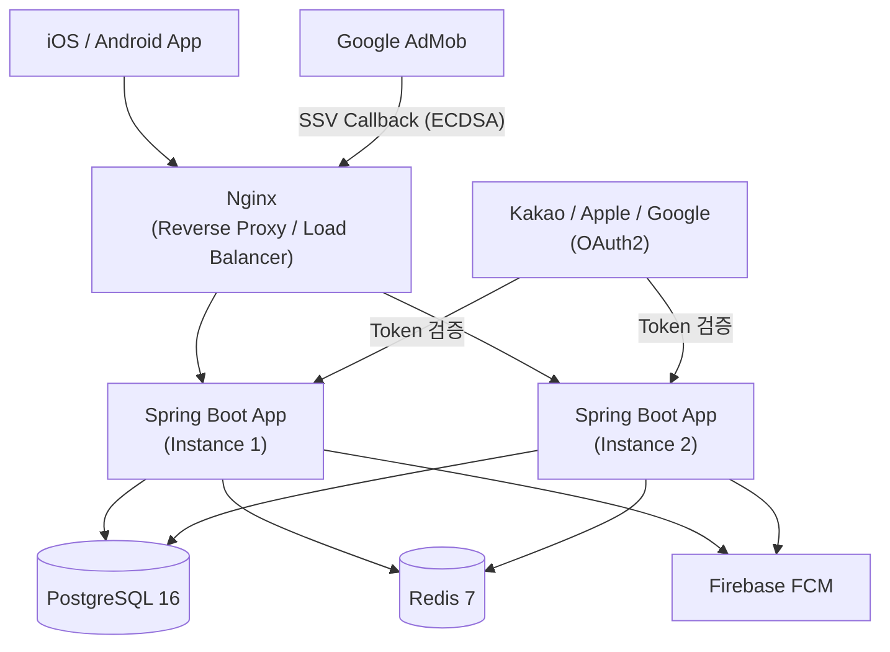
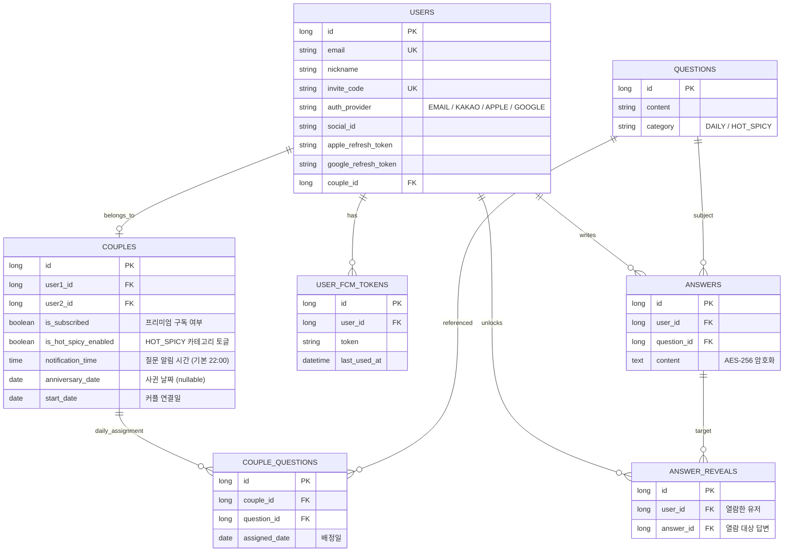

# 🔓 un:lock (언락) - 커플 소통 앱 Backend

> **"두 사람 모두 답변을 완료해야 열리는 상대방의 진심"**  
> 커플이 매일 질문에 답변하고, 상대방의 답변을 unlock하는 소통 서비스입니다.

- **Production**: [api.unlock-official.app](https://api.unlock-official.app)
- **API Docs (dev)**: [dev-api.unlock-official.app/swagger-ui/index.html](https://dev-api.unlock-official.app/swagger-ui/index.html) _(Basic Auth 보호 — 검토 요청 시 계정 제공)_

---

## 🏗️ 시스템 아키텍처


```mermaid
flowchart TD
    Client["iOS / Android App"]
    Nginx["Nginx\n(Reverse Proxy / Load Balancer)"]
    App1["Spring Boot App\n(Instance 1)"]
    App2["Spring Boot App\n(Instance 2)"]
    DB[("PostgreSQL 16")]
    Redis[("Redis 7")]
    FCM["Firebase FCM"]
    AdMob["Google AdMob"]
    Social["Kakao / Apple / Google\n(OAuth2)"]

    Client --> Nginx
    AdMob -->|"SSV Callback (ECDSA)"| Nginx
    Nginx --> App1 & App2
    App1 & App2 --> DB & Redis
    App1 & App2 --> FCM
    Social -->|"Token 검증"| App1 & App2
```

- **단일 호스트**에서 `dev` / `prod` 환경을 독립된 Docker Compose 스택으로 분리 운영
- Nginx healthcheck 연동으로 비정상 컨테이너로의 트래픽 자동 차단
- GitHub Actions CI/CD: 빌드(`-x test`) → DockerHub 이미지 푸시 → SSH로 원격 서버에서 `docker-compose --force-recreate` 배포 자동화

---

## 🛠️ 기술 스택

| 영역 | 기술 |
|------|------|
| Backend | Java 21, Spring Boot 3.3.4, Spring Security, Spring Data JPA |
| Query | Querydsl 5.0.0 (Jakarta), PostgreSQL 16 |
| Infra | Nginx, Docker & Docker Compose, GitHub Actions, Redis 7 |
| Auth | JWT (jjwt 0.12.6), Kakao OAuth2, Apple Sign In, Google OAuth2, BCrypt |
| Push | Firebase Admin SDK (FCM) — Silent Push, 다중 기기 비동기 발송 |
| Docs | Swagger (OpenAPI 3.0) |

---

## 🧠 기술적 구현 포인트

### 1. JPA N+1 해결 — Querydsl DTO Projection

아카이브(캘린더) 조회 시, 월별 질문 목록 N건을 가져온 뒤 각 질문마다 나의 답변·파트너 답변·열람 여부를 개별 쿼리로 확인하는 N+1이 발생했습니다.

- **기존**: 질문 목록 1회 + 내 답변 확인 N회 + 파트너 답변 확인 N회 = **한 달(30일) 기준 61회**
- **개선**: Querydsl `Projections.constructor` + 4-way LEFT JOIN으로 **단 1회**로 단축
- 구독 여부(`isSubscribed`)에 따라 `isRevealedExpr` 표현식을 조건부로 분기하여 불필요한 서브쿼리 제거

```java
BooleanExpression isRevealedExpr = isSubscribed
    ? Expressions.asBoolean(true)
    : answerReveal.id.isNotNull();  // AnswerReveal JOIN 존재 여부로 열람 판단
```

---

### 2. 분산 환경 안전 스케줄러 (Redis 분산락)

매 분 실행되는 `@Scheduled` 스케줄러가 다중 인스턴스 환경에서 중복 실행되면 같은 커플에게 알림이 2회 발송됩니다.

- **해결**: `LOCK:{yyyyMMddHHmm}` 키로 Redis `SETNX`(분산락) 획득에 성공한 인스턴스만 실행
- 락 TTL 59초로 설정 — 처리 완료 후 자동 해제, 다음 분 스케줄에는 영향 없음
- 파트너 미답변 여부에 따라 **상황별 메시지**("파트너가 기다리고 있어요" / "아직 답변 안 하셨어요") 분기 발송

---

### 3. Google AdMob SSV (Server-Side Verification)

클라이언트에서 광고 완료를 보고하면 앱 조작으로 무료 열람이 가능한 취약점이 있습니다.

- **해결**: Google이 직접 서버를 호출하는 AdMob SSV 구현
- Google 공개키(ECDSA `SHA256withECDSA`) 서명 검증 — 공개키는 24시간 인메모리 캐싱으로 외부 호출 최소화
- Redis `ADMOB_TX:{transactionId}` (TTL 7일)로 중복 처리 방지
- 검증 완료 후 FCM **Silent Push**로 앱이 UI 알림 없이 조용히 화면 갱신

---

### 4. 다중 소셜 로그인 및 계정 통합

Kakao / Apple / Google OAuth2와 이메일 가입을 함께 지원하며, 동일 이메일로 서로 다른 소셜 로그인이 시도될 때 계정을 자동 통합합니다.

- **전략 패턴**: `SocialAuthService` 인터페이스 + 제공자별 구현체 (`KakaoAuthService`, `AppleAuthService`, `GoogleAuthService`), `List<SocialAuthService>` 주입으로 런타임 라우팅
- **Apple Sign In**: 클라이언트에서 받은 `identityToken`을 Apple 공개키로 JWT 서명 직접 검증
- **계정 통합**: 소셜 신규 로그인 시 동일 이메일의 기존 가입 계정이 있으면 소셜 정보를 병합 — 사용자가 가입 경로를 몰라도 자연스럽게 통합
- **회원 탈퇴 revoke**: 카카오(Admin Key unlink), 애플(`appleRefreshToken`으로 revoke), 구글(`googleRefreshToken`으로 revoke) 각각 처리하여 소셜 플랫폼 연동 완전 해제

---

### 5. 애플리케이션 레벨 AES-256 암호화

답변 내용(`answers.content`)을 DB에 저장하기 전 JPA `AttributeConverter`로 AES-256 암호화·복호화를 자동 처리합니다.

- DB 유출 시에도 원문 보호
- 서비스 레이어에서는 평문으로만 다루므로 암호화 로직 완전 분리

---

### 6. 커플 연결 시스템 (Redis TTL)

초대 코드 기반 커플 연결 신청을 Redis로 관리합니다.

- `CP_REQ:{targetUserId}` (TTL 24h): 수신자 기준 신청 정보 저장
- `CP_REQ_SENT:{requesterId}` (TTL 24h): 발신자 중복 신청 방지
- TTL 만료 시 자동 무효화 — 별도 배치 없이 만료 처리

---

## 🗄️ 데이터베이스 설계 (ERD)


```mermaid
erDiagram
    USERS ||--o| COUPLES : "belongs_to"
    USERS ||--o{ USER_FCM_TOKENS : "has"
    COUPLES ||--o{ COUPLE_QUESTIONS : "daily_assignment"
    QUESTIONS ||--o{ COUPLE_QUESTIONS : "referenced"
    USERS ||--o{ ANSWERS : "writes"
    QUESTIONS ||--o{ ANSWERS : "subject"
    USERS ||--o{ ANSWER_REVEALS : "unlocks"
    ANSWERS ||--o{ ANSWER_REVEALS : "target"

    USERS {
        long id PK
        string email UK
        string nickname
        string invite_code UK
        string auth_provider "EMAIL / KAKAO / APPLE / GOOGLE"
        string social_id
        string apple_refresh_token
        string google_refresh_token
        long couple_id FK
    }
    USER_FCM_TOKENS {
        long id PK
        long user_id FK
        string token
        datetime last_used_at
    }
    COUPLES {
        long id PK
        long user1_id FK
        long user2_id FK
        boolean is_subscribed "프리미엄 구독 여부"
        boolean is_hot_spicy_enabled "HOT_SPICY 카테고리 토글"
        time notification_time "질문 알림 시간 (기본 22:00)"
        date anniversary_date "사귄 날짜 (nullable)"
        date start_date "커플 연결일"
    }
    QUESTIONS {
        long id PK
        string content
        string category "DAILY / HOT_SPICY"
    }
    COUPLE_QUESTIONS {
        long id PK
        long couple_id FK
        long question_id FK
        date assigned_date "배정일"
    }
    ANSWERS {
        long id PK
        long user_id FK
        long question_id FK
        text content "AES-256 암호화"
    }
    ANSWER_REVEALS {
        long id PK
        long user_id FK "열람한 유저"
        long answer_id FK "열람 대상 답변"
    }
```

---

## 🔑 Redis 키 패턴

| 키 | 용도 | TTL |
|----|------|-----|
| `RT:{userId}` | Refresh Token | 설정값 |
| `AUTH:{email}` | 이메일 인증 코드 | 3분 |
| `LOCK:{yyyyMMddHHmm}` | 스케줄러 분산락 | 59초 |
| `CP_REQ:{targetUserId}` | 커플 연결 신청 | 24시간 |
| `CP_REQ_SENT:{requesterId}` | 중복 신청 방지 | 24시간 |
| `ADMOB_TX:{transactionId}` | AdMob 중복 방지 | 7일 |

---

## 📌 주요 비즈니스 흐름

### unlock 흐름
- **프리미엄**: `isSubscribed == true` → 즉시 열람
- **광고**: Google AdMob SSV 콜백 → ECDSA 검증 → Redis 중복 체크 → `AnswerReveal` 저장 → FCM Silent Push
- **열람 판단**: `isSubscribed || answerRevealRepository.existsByUserAndAnswer(user, partnerAnswer)`

### 질문 배정 흐름
- 매 분 스케줄러 실행 → Redis 분산락 획득 → 해당 시각을 알림 시간으로 설정한 커플 조회 (Fetch Join)
- 미답변 상태에 따라 개인화된 알림 메시지 분기 발송
